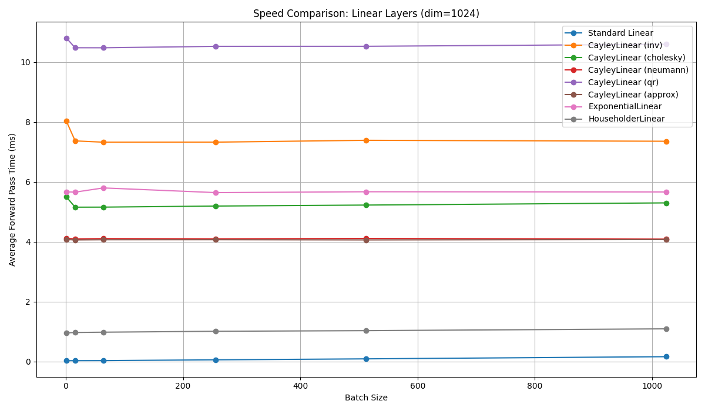

# Orthogonal Linear Layers in PyTorch

> This post is aimed at PyTorch users and ML researchers interested in efficient transformer architectures. 

If you haven't heard, the [Muon optimizer](https://github.com/muon-optimizer/muon) is impressive and thought-provoking.

It achieves roughly [1.35x faster training](https://x.com/kellerjordan0/status/1842300916864844014) for the nanoGPT speedrun.

How?

It uses Newton-Schulz iterations to orthogonalize weight updates before each optimization step.

This isn’t the first time researchers have tried to introduce orthogonality. Some have used Singular Value Decomposition (SVD) to enforce it, while others have added additional loss terms to encourage it in the weight matrix.

This got me thinking, rather than addressing orthogonality in the weight updates, can we change how weight matrices are parameterized to enforce it?

For instance, rather than storing $n^2$ parameters, can we store the minimum number of parameters for an orthogonal matrix?

Could we also use a more efficient algorithm to train with this parameterization?

## Why do we want orthogonal weight matrices?

Unconstrained weight matrices can **rotate**, **scale**, and **skew** inputs. Obviously this works, but is it an overparameterization for many parts of a transformer?

For example, do we need to scale and skew the tokens in key and value matrices before attention? Is it enough to just rotate them?

The Muon optimizer suggests that rotation is enough.

Let's consider some definitions: $O(n)$ and $SO(n)$.
- $O(n)$
  - All matrices that satisfy $A^T A = I$
  - This includes all rotations and reflections
  - The determinant is ±1 preserving the norm of the input
  - When the determinant is -1, the matrix is a reflection.
- $SO(n)$
  - The same as $O(n)$ but $\det(A) = 1$
  - This restricts to pure rotations

For both, the condition number is 1, which provides numerical stability - very helpful for training deep networks. This can prevent exploding or vanishing gradients - making optimization more stable.

Let's consider the key and value matrices in a transformer. Tokens in a sequence are independently mapped to $k = x W_K$ and $v = x W_V$ before attention.

If these weight matrices are strictly orthogonal, they will rotate each token’s features without scaling or skewing, ensuring:

- **Independent Dimensions**: features are rotated independently, maintaining distinct representations.
- **Stability**: no skewing of features, so `nn.LayerNorm` is potentially redundant.
- **Parameter Efficiency**: $SO(n)$ minimally requires $\frac{n(n-1)}{2}$ parameters, compared to $n^2$ for full matrices.
- **FLOPs Efficiency**: If a suitable parameterization of $SO(n)$ is found, the number of FLOPs required to compute the rotation can potentially be reduced.

So is there an efficient way to parameterize $SO(n)$?

## Soft Constraints

Before diving into strict parameterizations, let’s look at a simpler approach that optimizes weights toward orthogonality.

For a weight matrix $W$, we can minimize:

$A^T A - I = 0$

Such a constraint can be applied to a linear layer with an additional loss term:

```python
dim = 512
linear = nn.Linear(dim, dim)
orthogonal_loss = torch.norm(linear.weight.T @ linear.weight - torch.eye(dim, device=linear.weight.device))
```

This helps to provide the stability of an orthogonal layer, but adds computation. It does not minimize the number of parameters or enforce orthogonality.

# Parameterization approaches for $SO(n)$

Here are five ways to parameterize $SO(n)$, each with trade-offs in efficiency and complexity

- Givens Rotations
- Clifford Algebras (rotors)
- Exponential Map (Lie algebra)
- Cayley Transform (skew-symmetric)
- Householder Reflections

## Benchmarking

Before we dive into the details, let's look at some benchmarking on a GPU.

None of them are as fast as a dense linear layer on a GPU... _yet_



## Givens Rotations

Givens rotations parameterize $SO(n)$ with $\frac{n(n-1)}{2}$ angles, each tied to a pair of dimensions.

The number of angles is due to the number of unique pairs of dimensions in an $n$-dimensional space. You can also think of this as the number of planes, where two dimensions (or basis vectors) define a plane.

A Givens rotation is a 2d rotation matrix, positioned at specific $ij$ indices within a larger ($n \times n$) identity matrix.

$$
G_{ij} = \begin{bmatrix}
    1 & 0 & 0 & \cdots & 0 \\
    0 & \cos \theta & -\sin \theta & \cdots & 0 \\
    0 & \sin \theta & \cos \theta & \cdots & 0 \\
    \vdots & \vdots & \vdots & \ddots & \vdots \\
    0 & 0 & 0 & \cdots & 1
\end{bmatrix}
$$

Any higher dimensional $SO(n)$ matrix can be built by multiplying 
$\frac{n(n-1)}{2}$ rotation matrices, each rotating the input in a different plane.

Given an $n$-dimensional weight matrix $W$, we can define all planes as:

```python
pairs = [(i, j) for i in range(dim) for j in range(i + 1, dim)]
```

Rather than materializing each sparse rotation matrix and multiplying them together, the combined matrix can be computed in place with:

```python
def weight_matrix(angles, pairs, dim):
    W = torch.eye(dim, device=angles.device)
    cos_vals, sin_vals = torch.cos(angles), torch.sin(angles)
    for idx, (i, j) in enumerate(pairs):
        cos_theta, sin_theta = cos_vals[idx], sin_vals[idx]
        Wi, Wj = W[:, i].clone(), W[:, j].clone()
        W[:, i] = cos_theta * Wi - sin_theta * Wj
        W[:, j] = sin_theta * Wi + cos_theta * Wj
    return W
```

With this, we can build a linear layer with that enforces orthogonality.

Here is a drop in replacement for standard `nn.Linear` layer for vector (not matrix) inputs.

```python
class GivensLinear(nn.Module):
    def __init__(self, dim, bias=True):
        super(GivensLinear, self).__init__()
        self.dim = dim
        self.pairs = [(i, j) for i in range(dim) for j in range(i + 1, dim)]
        self.angles = nn.Parameter(torch.randn(len(self.pairs)) * 0.01)
        self.bias = nn.Parameter(torch.zeros(dim)) if bias else None

    def _compute(self, output):
        cos_vals, sin_vals = torch.cos(self.angles), torch.sin(self.angles)
        for idx, (i, j) in enumerate(self.pairs):
            output[:, [i, j]] = output[:, [i, j]] @ torch.tensor(
                [[cos_vals[idx], -sin_vals[idx]], [sin_vals[idx], cos_vals[idx]]],
                device=output.device,
                dtype=output.dtype,
            )
        return output

    def forward(self, x):
        assert x.shape[-1] == self.dim
        output = self._compute(x)
        return output + self.bias if self.bias is not None else output
```

**Comparing Parameters**

This linear layer takes $\frac{n(n-1)}{2}$ parameters, compared to $n^2$ for a full matrix.

$$
\frac{n(n-1)}{2} / n^2 = \frac{n-1}{2n} \approx 49.9\%
$$

This is a reduction of 50% in parameters.

**Comparing FLOPs**

The classic linear layer (for vector inputs):

$$
y=xA+b
$$

This requires a vector-matrix multiplication ($xA$), which is O(n²) FLOPs.

This is the same as the Givens linear layer.

However, the Givens layer *must* be computed sequentially through the pairs of dimensions, whereas vector-matrix multiplication is highly parallel.

As a result, the Givens layer is **significantly slower** than the classic linear layer on a GPU.

**Potential Optimizations**

GivensLinear can be optimized by considering that disjoint rotations can be applied in parallel. So, careful parallel scheduling of rotations reduces the step count to O(n), with $\lfloor \frac{n}{2} \rfloor$ rotations per step. However, total FLOPs remain approximately O(n²).

Therefore, Givens composition is parameter-efficient but computationally intensive.

## Clifford Algebras

Clifford algebras, $Cl(n)$, offer a way to manage rotations in $n$-dimensional space.

It is a system that fuses numbers and directions into a framework.

Consider a space with $n$ directions, like $x, y, z$ in 3D. These are defined by basis vectors: $e_1$ (a unit step along $x$), $e_2$ (along $y$), up to $e_n$. 

These vectors follow multiplication rules:
- $e_i e_i = 1$ (square to 1)
- $e_i e_j = -e_j e_i$ (anti-commutative)
- $e_i \cdot e_j = 0$ (perpendicular)

This setup was crafted by William Clifford in the 1870s, combining quaternions and Grassmann algebras. His aim was a system capturing space’s geometry, defining how lines, planes, and volumes interact.

From these rules, $Cl(n)$ generates:
- scalars
- vectors (arrows like $3 e_1 + 2 e_2$),
- bivectors (rotating planes like $e_1 e_2$)

Now, how do we rotate things in this system?

Introducing a rotor, $R$.

A rotor is a special object from $Cl(n)$ designed to spin vectors without stretching them.

A single-plane rotor is:
$$
R_{ij} = \cos(\theta/2) + \sin(\theta/2) e_i e_j
$$

This is a multivector, blending numbers and plane-spinning terms, and it rotates a vector $x$ into $x'$ via:

$$
R x \tilde{R} = x'
$$

This keeps $x$’s length unchanged, aligning with $SO(n)$’s rule for pure rotations.

A general rotor combines these across $\frac{n(n-1)}{2}$ planes:

$$
R = \prod_{k=1}^{\frac{n(n-1)}{2}} [\cos(\theta_k/2) + \sin(\theta_k/2) B_k]
$$

Where $B_k$ is a bivector defined as $e_i e_j$ for some $i, j$ pair.

You can likely see similarities between this and Givens rotations. Both approaches define $SO(n)$ matrices as a product of simpler, rotations of planes.

As a result, Clifford rotors generalize elegantly but end up reducing to Givens rotations when implemented.

## Exponential Map

The exponential map connects linear spaces to curved geometric structures.

Both the Orthogonal Group $O(n)$ and the Special Orthogonal Group $SO(n)$ are [Lie groups](https://en.wikipedia.org/wiki/Lie_group), meaning they are groups with a specific geometric structure.

We’re aiming to parameterise a linear layer weight matrix in the Special Orthogonal group $W \in SO(n)$.

The [Lie algebra](https://en.wikipedia.org/wiki/Lie_algebra) of $SO(n)$, denoted $so(n)$, is the tangent space at the identity, consisting of all $n \times n$ skew-symmetric matrices $A$ where $A^T = -A$.

This space has dimension $n(n-1)/2$, reflecting the degrees of freedom in an $n$-dimensional rotation.

The exponential map bridges this algebra to the group:

$$
\exp: \mathfrak{so}(n) \to SO(n), \quad A \mapsto \exp(A) = \sum_{k=0}^\infty \frac{1}{k!} A^k
$$

For any skew-symmetric $A$, $\exp(A)$ is an orthogonal matrix in $SO(n)$. This property is rooted in the geometry of the Stiefel manifold $V_n(\mathbb{R}^n)$, where $SO(n)$ resides as a subset of all orthonormal $n$-frames. The exponential map provides a smooth path from a linear representation (skew-symmetric matrices) to the curved space of rotations, making it a natural fit for enforcing orthogonality in deep learning.

There are two interesting ways we can apply exponential maps
- projecting gradients onto the local orthogonal space
- directly parameterizing the weight matrix
 
### Projecting Gradients onto the Local Orthogonal Space

This method starts with a standard $n \times n$ weight matrix $W$ and ensures it remains on $SO(n)$ during training.

It uses the exponential map to update $W$ by projecting the loss gradient into the tangent space at $W$ (the "local orthogonal space") and then curving the update along the manifold.

During training, we calculate $\nabla_W L$, the gradient of the loss with respect to $W$, as in standard gradient descent.

Project $\nabla_W L$ into $so(n)$ at $W$ using:
$$
G = \frac{1}{2} W^T (\nabla_W L - W \nabla_W L^T W)
$$

$G$ is skew-symmetric and represents the orthogonal component of the gradient.  

Update $W$ via:
$$
W_{\text{new}} = W \exp(\beta G)
$$
where $\beta$ is the learning rate, and $\exp(\beta G)$ is computed with `torch.linalg.matrix_exp`

We can build a custom optimizer

```python
class ExponentialOptimizer:
    def __init__(self, model, lr=0.01):
        self.model = model
        self.lr = lr

    def step(self):
        for param in self.model.parameters():
            if param.grad is not None:
                W = param.data  # Current weight matrix
                grad = param.grad
                # Project gradient into tangent space
                G = 0.5 * (W.T @ (grad - W @ grad.T @ W))
                # Update W using exponential map
                update = torch.linalg.matrix_exp(self.lr * G)
                param.data = W @ update
```

And use it like this

```python
model = nn.Linear(3, 3, bias=False)
optimizer = ExponentialOptimizer(model, lr=0.01)
input_data = torch.randn(1, 3)
output = model(input_data)
loss = output.sum()  # Dummy loss
loss.backward()
optimizer.step()
```

This method requires storing $n^2$ parameters and has $O(n^3)$ complexity due to the matrix exponential and projection steps.

Ideal when you want to retrofit orthogonality into a pre-existing transformer layer without changing its structure. Could be used as an alternative to the Muon optimizer.

### Direct Parameterization with the Exponential Map

This method parameterizes the weight matrix $W$ directly as $W = \exp(A)$.

By working in the Lie algebra $so(n)$, we ensure $W$ is always in $SO(n)$ without additional projections.

We store the $\frac{n(n-1)}{2}$ upper triangular elements of $A$, constructing a skew-symmetric matrix. The orthogonal weight matrix is then computed using `torch.linalg.matrix_exp`.

We can build a custom linear layer with this method

```python
class ExponentialLinear(nn.Module):
    def __init__(self, dim, bias=True):
        super(ExponentialLinear, self).__init__()
        self.dim = dim
        self.num_params = (dim * (dim - 1)) // 2
        self.upper_indices = torch.triu_indices(dim, dim, offset=1)
        self.angles = nn.Parameter(torch.randn(self.num_params) * 0.01)
        self.bias = nn.Parameter(torch.zeros(dim)) if bias else None

    def _construct_skew_symmetric(self):
        A = torch.zeros(self.dim, self.dim, device=self.angles.device, dtype=self.angles.dtype)
        A[self.upper_indices[0], self.upper_indices[1]] = self.angles
        A[self.upper_indices[1], self.upper_indices[0]] = -self.angles
        return A

    def forward(self, x):
        A = self._construct_skew_symmetric()
        W = torch.linalg.matrix_exp(A)
        output = x @ W
        if self.bias is not None:
            output += self.bias
        return output
```

## Cayley Transform

The Cayley Transform offers a compelling approach to parameterize $SO(n)$. It maps a skew-symmetric matrix $A$ (where $A^T = -A$) to an orthogonal matrix via:

$W = (I - A)^{-1}(I + A)$

Here, $I$ is the identity matrix, and $A$ is a skew-symmetric $n \times n$ matrix. This transformation ensures $W \in SO(n)$ (with determinant 1), provided $I - A$ is invertible, which holds as long as $-1$ is not an eigenvalue of $A$.

The Cayley Transform is parameter-efficient. A skew-symmetric matrix $A$ has zeros on the diagonal and $\frac{n(n-1)}{2}$ independent entries above the diagonal (the lower triangle is determined by $A_{ji} = -A_{ij}$). This matches the minimal number of parameters required for $SO(n)$.

It provides a direct mapping from a compact set of parameters to the $SO(n)$ manifold, avoiding the iterative composition of Givens rotations or the heavy eigenvalue computations of the exponential map.

During training, you optimize the parameters of $A$ directly. The gradient flows through the $W$ transform, and since $W$ is guaranteed to be in $SO(n)$, no additional constraints or projections are needed.

Let's explore an implementation of the Cayley Transform.

```python
def cayley_transform_exact(A):
    I = torch.eye(A.shape[-1], device=A.device, dtype=A.dtype)
    W = torch.linalg.solve(I - A, I + A)
    return W
```

We can build a linear layer from this

```python
class CayleyLinear(nn.Module):
    def __init__(self, dim, bias=True):
        super(CayleyLinear, self).__init__()
        self.dim = dim
        self.num_params = (dim * (dim - 1)) // 2
        self.upper_indices = torch.triu_indices(dim, dim, offset=1)
        self.angles = nn.Parameter(torch.randn(self.num_params) * 0.01)
        self.bias = nn.Parameter(torch.zeros(dim)) if bias else None
        assert len(self.upper_indices) == self.num_params

    def _construct_skew_symmetric(self):
        A = torch.zeros(self.dim, self.dim, device=self.angles.device, dtype=self.angles.dtype)
        A[self.upper_indices[0], self.upper_indices[1]] = self.angles
        A[self.upper_indices[1], self.upper_indices[0]] = -self.angles
        return A

    def forward(self, x):
        assert x.shape[-1] == self.dim
        output = x @ cayley_transform_exact(self._construct_skew_symmetric())
        return output + self.bias if self.bias is not None else output
```

We store the $\frac{n(n-1)}{2}$ upper-triangular elements of a skew-symmetric matrix. This is the minimal number of parameters for $SO(n)$.

To construct $W$ from $A$ we need to compute $(I - A)^{-1}(I + A)$, which is $O(n^3)$ but parallelizable on the GPU.

## Householder Reflections

Householder reflections offer an alternative approach. A Householder reflection is a linear transformation that reflects a vector over a hyperplane defined by a unit vector $v \in \mathbb{R}^n$. The corresponding matrix is:

$$
H = I - 2 v v^T
$$

See [here](https://www.netlib.org/lapack/lug/node128.html) for more details.

where $I$ is the $n \times n$ identity matrix, and $v v^T$ is the outer product of $v$ with itself.

This matrix $H$ is orthogonal ($H^T H = I$), but a single reflection has determinant $\det(H)=-1$, making it a reflection rather than a rotation.

Since $SO(n)$ requires $\det(W)=1$, a single Householder reflection isn't enough. However, the product of an even number of reflections can build a rotation with determinant 1.

In fact, any matrix in $SO(n)$ can be expressed as a product of at most $n$ Householder reflections:

$$
W = H_1 H_2 \cdots H_m, \quad \text{where} \quad H_i = I - 2 v_i v_i^T,
$$

Typically, $m \leq n$, and the exact number depends on the specific rotation and dimensionality $n$. For example, in 3D ($n=3$), a rotation can often be constructed with just two reflections, but to parameterize the full $SO(n)$ generally requires up to $n$ reflections.

Each Householder reflection is defined by a unit vector $v_i \in \mathbb{R}^n$, which lies on the unit sphere $S^{n-1}$ and thus has $n-1$ independent parameters. For $m$ reflections, the total parameter count is:

$$
m \cdot (n-1)
$$

This exceeds the minimal number of parameters required for $SO(n)$. This means Householder reflections are overparameterized.

To cover all of $SO(n)$, which has dimension $n(n-1)/2$, we need:

$$
m \cdot (n-1) \geq n(n-1)/2 \quad \Rightarrow \quad m \geq n/2
$$

We could use fewer reflections, say $m \approx n/2$, to approach the minimal parameter count, but this risks not spanning the full $SO(n)$ for all $n$. In practice, $m=n$ ensures full coverage, though at the cost of extra parameters compared to methods like Givens rotations or the Cayley transform.

```python
class HouseholderLinear(nn.Module):
    def __init__(self, dim, num_reflections=None, bias=True):
        super(HouseholderLinear, self).__init__()
        self.dim = dim
        self.m = num_reflections if num_reflections is not None else dim
        self.vectors = nn.Parameter(torch.randn(self.m, dim) * 0.01)
        self.bias = nn.Parameter(torch.zeros(dim)) if bias else None

    def forward(self, x):
        assert x.shape[-1] == self.dim
        output = x.clone()
        v_normed = self.vectors / torch.norm(self.vectors, p=2, dim=1, keepdim=True)
        for i in range(self.m):
            v = v_normed[i]
            proj = torch.einsum("...d,d->...", output, v)  # Dot product
            output = output - 2 * torch.einsum("...,d->...d", proj, v)
        return output + self.bias if self.bias is not None else output
```

The drawback is the sequential nature of the reflections, which is a major bottleneck on the GPU.

## Summary

There are a handful of ways to parameterize $SO(n)$

Here’s the rundown:

- **Givens Rotations**: Uses a list of $\frac{n(n-1)}{2}$ angles to build $W$ with sequential rotations.
- **Clifford Algebras**: Rotors combine scalars and bivectors for rotations. Reduces to Givens sequential steps.
- **Exponential Map**: Maps skew-symmetric matrices to $SO(n)$ with the matrix exponential.
- **Cayley Transform**: Turns skew-symmetric $A$ into $W$ with matrix inversion.
- **Householder Reflections**: Builds rotations from $m \leq n$ reflections, each with $n-1$ parameters.

From these, the methods that can be accelerated on a GPU are
- Cayley Transform
- Exponential Map
- Householder Reflections

Householder reflections are slightly overparameterized, requiring $m \approx n/2$ reflections to span $SO(n)$. They also do not target specific planes, unlike Givens rotations or the Cayley transform.

| Method                  | Parameters         | Computation              | GPU Efficiency | Notes                              |
|-------------------------|--------------------|--------------------------|----------------|------------------------------------|
| Standard Dense Linear   | n²                 | O(n²)                    | Excellent      | No orthogonality; more parameters  |
| Givens Rotations        | n(n-1)/2           | O(n²) sequential         | Poor           | Slow; sequential application       |
| Clifford Rotors         | n(n-1)/2           | O(n²) sequential         | Poor           | Similar to Givens; sequential      |
| Exponential Map         | n(n-1)/2           | O(n³) prep + O(bn²) apply| Excellent      | GPU-friendly; uses matrix_exp      |
| Cayley Transform        | n(n-1)/2           | O(n³) prep + O(bn²) apply| Excellent      | GPU-friendly; uses matrix inverse  |
| Householder Reflections | m(n-1), m ≤ n      | O(n²) prep + O(bn²) apply| Excellent      | householder_product, τ=2; overparameterized |

## Support in PyTorch

PyTorch now supports orthogonal parameterizations - see [Pull Request #62089](https://github.com/pytorch/pytorch/pull/62089)

[torch.nn.utils.parametrizations.orthogonal](https://pytorch.org/docs/stable/generated/torch.nn.utils.parametrizations.orthogonal.html) 

Supported methods include, Matrix Exponential, Cayley transform, and Householder reflections.

i.e.

```python
layer = nn.Linear(10, 10)
layer = orthogonal(layer)
```

There is an interesting discussion on the original pitch for the orthogonal parameterization in [Issue #42243](https://github.com/pytorch/pytorch/issues/42243)



